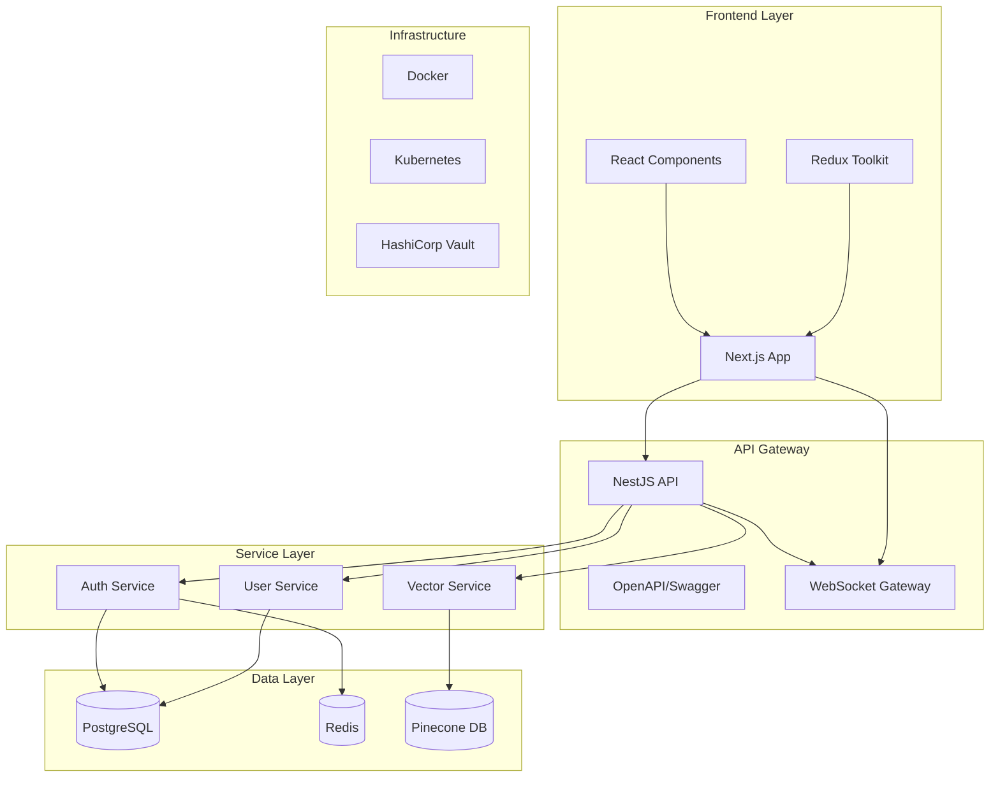
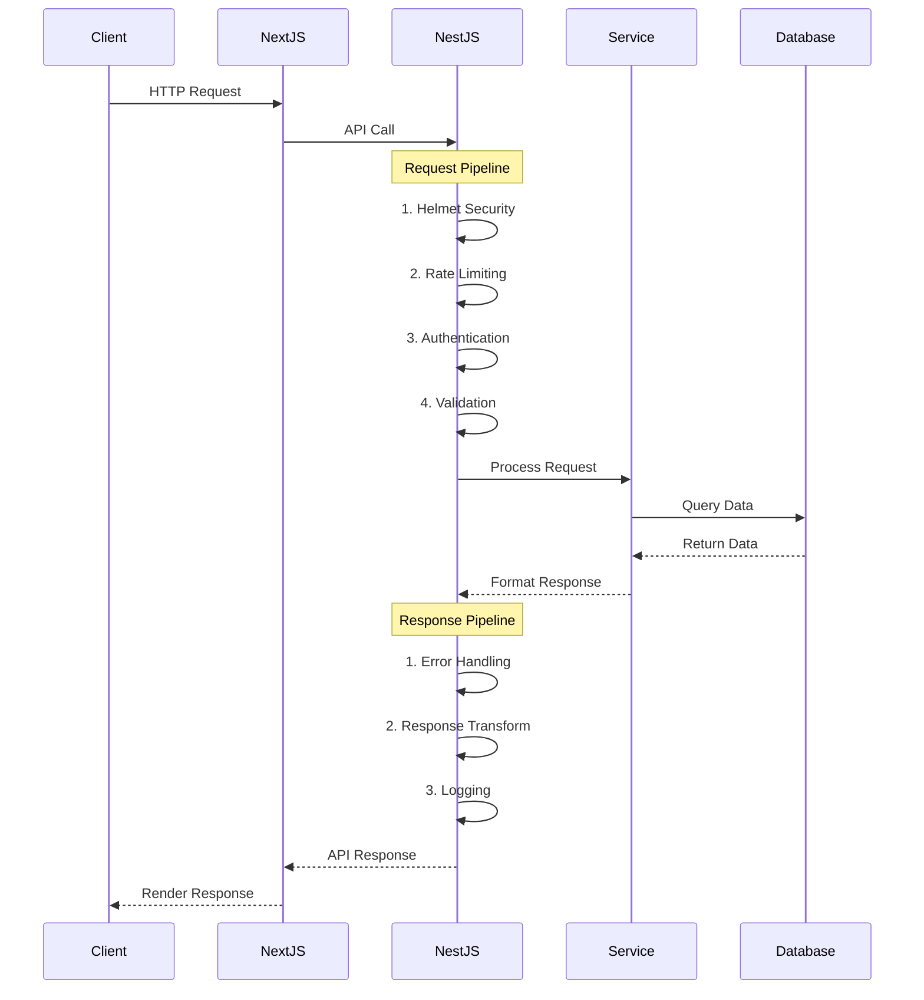
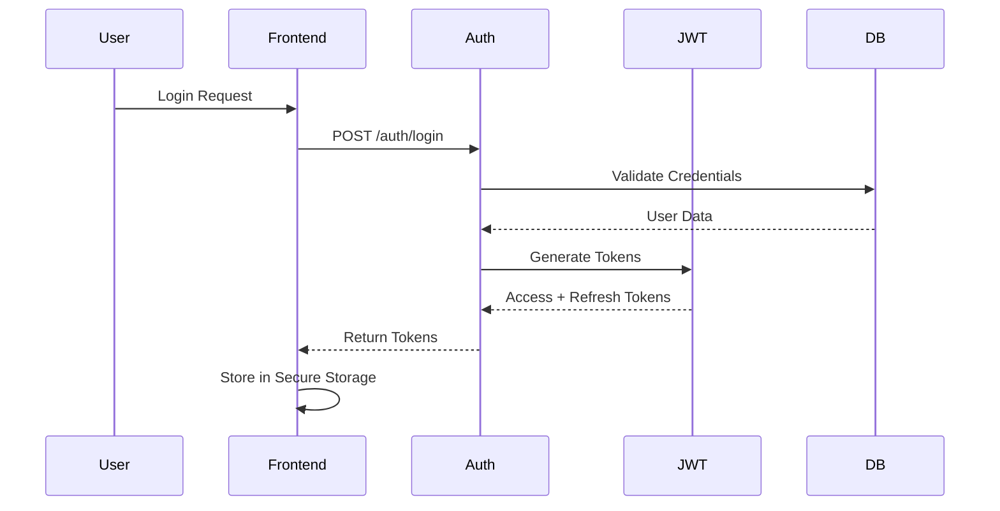
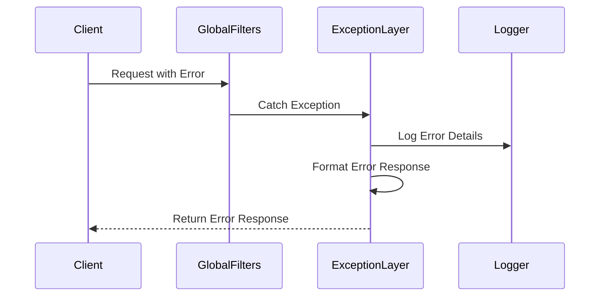
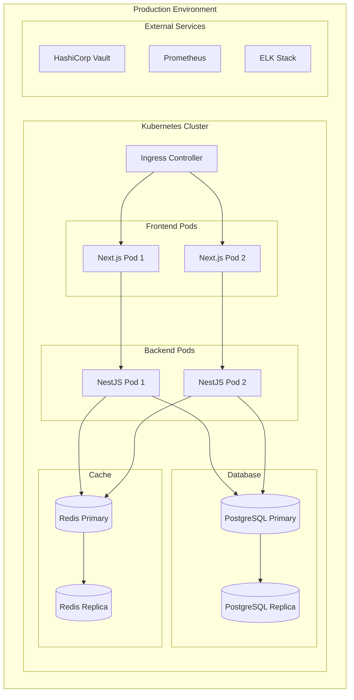

# Architecture Overview

## System Architecture

```mermaid
graph TB
    subgraph "Frontend Layer"
        Next[Next.js App]
        React[React Components]
        RTK[Redux Toolkit]
    end

    subgraph "API Gateway"
        NestJS[NestJS API]
        Swagger[OpenAPI/Swagger]
        WS[WebSocket Gateway]
    end

    subgraph "Service Layer"
        Auth[Auth Service]
        User[User Service]
        Vector[Vector Service]
    end

    subgraph "Data Layer"
        Postgres[(PostgreSQL)]
        Redis[(Redis)]
        Pinecone[(Pinecone DB)]
    end

    subgraph "Infrastructure"
        Docker[Docker]
        K8s[Kubernetes]
        Vault[HashiCorp Vault]
    end

    Next --> NestJS
    React --> Next
    RTK --> Next
    NestJS --> Auth
    NestJS --> User
    NestJS --> Vector
    Auth --> Postgres
    User --> Postgres
    Vector --> Pinecone
    Auth --> Redis
    NestJS --> WS
    Next --> WS
```

## Request Flow

```mermaid
sequenceDiagram
    participant Client
    participant NextJS
    participant NestJS
    participant Service
    participant Database

    Client->>NextJS: HTTP Request
    NextJS->>NestJS: API Call
    
    Note over NestJS: Request Pipeline
    NestJS->>NestJS: 1. Helmet Security
    NestJS->>NestJS: 2. Rate Limiting
    NestJS->>NestJS: 3. Authentication
    NestJS->>NestJS: 4. Validation
    
    NestJS->>Service: Process Request
    Service->>Database: Query Data
    Database-->>Service: Return Data
    Service-->>NestJS: Format Response
    
    Note over NestJS: Response Pipeline
    NestJS->>NestJS: 1. Error Handling
    NestJS->>NestJS: 2. Response Transform
    NestJS->>NestJS: 3. Logging
    
    NestJS-->>NextJS: API Response
    NextJS-->>Client: Render Response
```

## Authentication Flow

```mermaid
sequenceDiagram
    participant User
    participant Frontend
    participant Auth
    participant JWT
    participant DB
    
    User->>Frontend: Login Request
    Frontend->>Auth: POST /auth/login
    Auth->>DB: Validate Credentials
    DB-->>Auth: User Data
    Auth->>JWT: Generate Tokens
    JWT-->>Auth: Access + Refresh Tokens
    Auth-->>Frontend: Return Tokens
    Frontend->>Frontend: Store in Secure Storage
```

## Error Handling Flow

```mermaid
sequenceDiagram
    participant Client
    participant GlobalFilters
    participant ExceptionLayer
    participant Logger
    
    Client->>GlobalFilters: Request with Error
    GlobalFilters->>ExceptionLayer: Catch Exception
    ExceptionLayer->>Logger: Log Error Details
    ExceptionLayer->>ExceptionLayer: Format Error Response
    ExceptionLayer-->>Client: Return Error Response
```

## Deployment Architecture

```mermaid
graph TB
    subgraph "Production Environment"
        subgraph "Kubernetes Cluster"
            Ingress[Ingress Controller]
            
            subgraph "Frontend Pods"
                FE1[Next.js Pod 1]
                FE2[Next.js Pod 2]
            end
            
            subgraph "Backend Pods"
                BE1[NestJS Pod 1]
                BE2[NestJS Pod 2]
            end
            
            subgraph "Database"
                PG1[(PostgreSQL Primary)]
                PG2[(PostgreSQL Replica)]
            end
            
            subgraph "Cache"
                R1[(Redis Primary)]
                R2[(Redis Replica)]
            end
        end
        
        subgraph "External Services"
            Vault[HashiCorp Vault]
            Monitor[Prometheus]
            Logs[ELK Stack]
        end
    end
    
    Ingress --> FE1
    Ingress --> FE2
    FE1 --> BE1
    FE2 --> BE2
    BE1 --> PG1
    BE2 --> PG1
    PG1 --> PG2
    BE1 --> R1
    BE2 --> R1
    R1 --> R2
```
